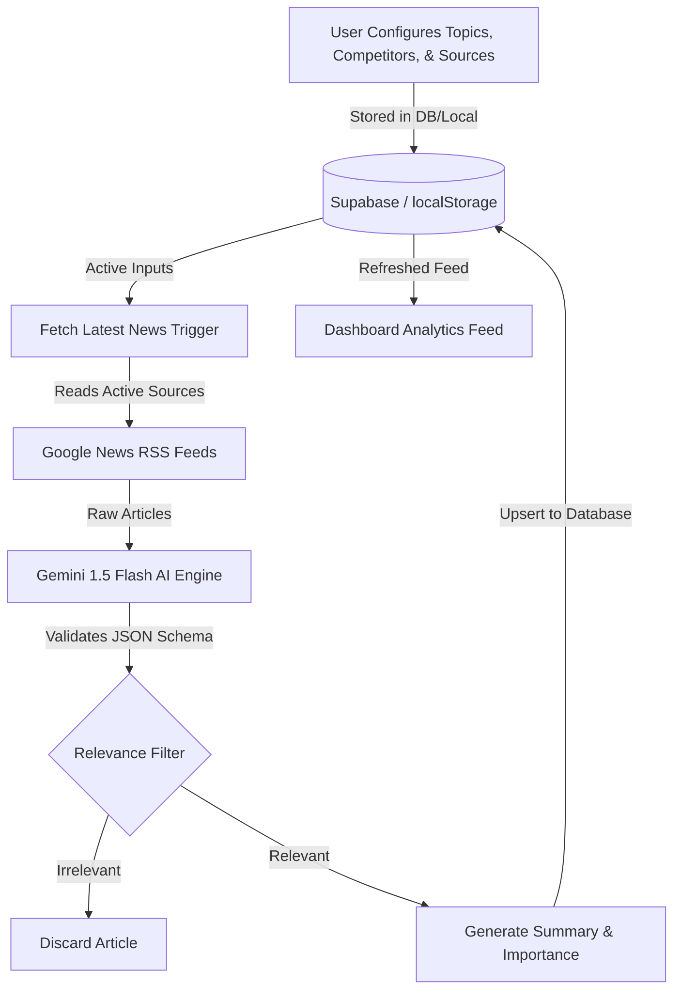

# Fashion News Monitoring Agent

An AI-powered intelligence agent designed to monitor global news feeds, filter noise, identify meaningful industry developments, and generate structured updates tailored to the fashion, apparel, and textile sectors.

[](https://nextjs.org/)
[](https://deepmind.google/technologies/gemini/)
[](https://supabase.com/)

---

## Overview

Staying informed about competitor activity, raw material price shifts, and retail consumer trends in the fashion industry is challenging due to the high volume of generic media noise.

The **Fashion News Monitoring Agent** is an MVP application that automates this workflow. It acts as an automated fashion industry analyst: crawling configured RSS feeds, passing content through Google's Gemini LLM to filter irrelevant noise, categorizing findings by topic, identifying competitor brand mentions, generating concise executive summaries, and explaining *why the news matters* for retail strategy.

---

## Features

*   **Live News Monitoring**: Integrates with live Google News RSS feeds to fetch the latest industry headlines based on custom search terms.
*   **AI-Powered Relevance Filtering**: Screens out unrelated news articles (e.g. general politics, sports, celebrity lifestyles) that match search keywords but don't pertain to fashion, textiles, retail, or consumer economics.
*   **Executive Summaries**: Distills complex articles into a single, punchy paragraph (max 3 sentences) optimized for executive reading.
*   **"Why It Matters" Strategic Analysis**: Generates professional reasoning outlining the direct market impact of the news on supply chains, product pricing, or marketing.
*   **Importance Classification**: Automatically classifies articles as **High**, **Medium**, or **Low** importance using LLM heuristics.
*   **Dynamic Entity Management**:
    *   **Topic Tracker**: CRUD interface to configure search terms (e.g. *Sustainability*, *Circular Economy*, *Cotton Prices*).
    *   **Competitor Monitor**: CRUD interface to register competitor brands (e.g. *Nike*, *Zara*, *H&M*) to check for direct mentions.
    *   **News Source Registry**: CRUD interface to configure feeds and assign crawling priorities.
*   **Interactive Dashboard**: A premium, dark-themed dashboard presenting analysis feeds, importance filters, topic categorizations, competitor mention tags, and real-time status indicators (Supabase connectivity and Gemini API key presence).
*   **Robust Fallbacks**: Bypasses network or AI API limits by falling back to local client state and pattern-matching simulators if cloud connections are not configured.

---

## Architecture

The system uses a serverless Next.js API endpoint to coordinate news ingestion, filter content, call the LLM, and persist results to the storage layer.



### Ingestion & Analysis Workflow
1.  **User Configuration**: The user defines targeted topics, brand competitors, and news feeds via the dashboard.
2.  **News Fetch**: Hitting the *Fetch Latest News* button triggers a POST request to `/api/fetch-news`. The API queries active RSS URLs, appends location tags, fetches feed XML, and extracts raw articles using server-side fetching.
3.  **AI Analysis**: Raw articles are sent to the AI service. If a Gemini key is configured, they are analyzed by `gemini-1.5-flash` using a system prompt that mandates a strict JSON output matching a predefined schema. If no key is set, it defaults to a local analyst simulator.
4.  **Relevance Filtering**: If the model flags the article as irrelevant, the backend discards it.
5.  **Summary Generation**: Relevant articles are structured with a concise summary, a strategic reasoning block ("Why It Matters"), and competitor tags.
6.  **Storage**: Validated articles are upserted into Supabase (`on conflict (url) do nothing`) to prevent duplicates, or saved to the browser's `localStorage` if running offline.
7.  **Dashboard**: The feed re-renders, displaying cards styled dynamically according to their importance level.

---

## Tech Stack

*   **Frontend**: Next.js 16 (App Router), React 19, Lucide React (Icons), React Context (Toast Notification System).
*   **Styling**: Vanilla CSS, Tailwind CSS v4.0 (for layout and utilities), Glassmorphism styling tokens.
*   **Backend**: Next.js Serverless Route Handlers (`app/api/fetch-news`).
*   **Database/Storage**: Supabase (PostgreSQL Client) with browser `localStorage` fallback.
*   **AI Integration**: Google Generative AI Developer SDK (`gemini-1.5-flash`).
*   **Deployment**: Vercel.

---

## Folder Structure

```text
swift/
├── app/
│   ├── api/fetch-news/route.ts   # Core serverless ingestion & AI pipeline endpoint
│   ├── competitors/page.tsx      # Competitor CRUD management interface
│   ├── settings/page.tsx         # API key, country target, and DB admin page
│   ├── sources/page.tsx          # RSS Feed CRUD management interface
│   ├── topics/page.tsx           # Monitored topic CRUD management interface
│   ├── globals.css               # Tailwind CSS imports and glassmorphic UI tokens
│   ├── layout.tsx                # Root HTML layout and Context ToastProvider wrapper
│   └── page.tsx                  # Dashboard workspace, metric cards, and feed
├── components/
│   ├── DashboardLayout.tsx       # Sidebar navigation, status indicators, and responsive shell
│   └── Toast.tsx                 # Dynamic, stackable pop-up alert system
├── db/
│   └── schema.sql                # Supabase PostgreSQL tables, RLS policies, and seed data
└── services/
    ├── ai.ts                     # Gemini SDK client, prompts, and analyst simulation fallback
    ├── db.ts                     # Database controller (detects Supabase; falls back to localStorage)
    └── news.ts                   # Ingest service (Google RSS regex parser + static mock fallback)
```

---

## Setup Instructions

### 1. Prerequisites
Ensure you have [Node.js](https://nodejs.org/) (v18.x or later) and `npm` installed.

### 2. Clone the Repository
```bash
git clone <repository-url>
cd swift
```

### 3. Install Dependencies
Install the required packages.
```bash
npm install
```

> [!NOTE]
> Make sure to install the runtime dependencies if they are missing from your package manifest:
> `npm install @supabase/supabase-js @google/generative-ai lucide-react`

### 4. Set Environment Variables (Optional)
To use cloud services, create a `.env.local` file in the root directory:
```env
# Supabase Keys (Optional - Falls back to browser localStorage if empty)
NEXT_PUBLIC_SUPABASE_URL=https://your-project-id.supabase.co
NEXT_PUBLIC_SUPABASE_ANON_KEY=your-supabase-anon-key

# Gemini API Key (Optional - Falls back to simulated parser if empty)
GEMINI_API_KEY=your-gemini-api-key
```

### 5. Database Provisioning (Optional)
If connecting to a Supabase instance:
1. Go to the Supabase console SQL Editor.
2. Paste and run the contents of [db/schema.sql](file:///c:/Users/Akshat/Downloads/Swift/swift/db/schema.sql) to set up tables, RLS access rules, and initial seeds.

### 6. Run the Development Server
```bash
npm run dev
```
Open [http://localhost:3000](http://localhost:3000) in your browser.

---

## Usage

### 1. Configure Monitored Entities
*   **Topics**: Go to the **Topics** tab. Add target search phrases (e.g., *Apparel Technology*). Toggle topics on or off to adjust feed filters.
*   **Competitors**: Go to the **Competitors** tab. Add competitor brand names (e.g., *Nike*, *Zara*). The AI automatically maps matching strings to tag mentions.
*   **Sources**: Go to the **Sources** tab. Input source names, Google News RSS endpoints, and priority ratings.

### 2. Set Up API Keys & Region
*   Go to **Settings**.
*   Select your target country (e.g. *USA*, *India*, *UK*, *Germany*, *China*).
*   Input your **Gemini API Key** to enable live LLM evaluation. If omitted, the sidebar indicates "Simulated" mode, and local pattern-matching triggers.

### 3. Fetch & Analyze News
*   Go to the **Dashboard** and click **Fetch Latest News**.
*   The button transitions to "AI Analyst Running...".
*   Once finished, a toast indicates the number of successfully parsed articles. The feed instantly updates.

### 4. View Insights
*   Filter incoming articles by **Importance** (High/Medium/Low), **Topic**, or **Competitors**.
*   Click the external link icon on headlines to read full articles.
*   Scan the side-by-side **AI Executive Summary** and **Why It Matters** segments.

---

## AI Workflow

1.  **Collection**: The server grabs the latest raw article titles, links, publication dates, and source names from feed XML.
2.  **Relevance Evaluation**: The agent evaluates titles and snippets. Relevance is determined by whether the article impacts apparel retail, textile materials, supply chains, or associated economics.
3.  **Importance Assignment**: The agent looks for major industry triggers:
    *   **High**: Bankruptcies, tariff shifts, supply chain collapses, mega-mergers, or price spikes.
    *   **Medium**: Product launches, store openings, earnings reports, or designer collabs.
    *   **Low**: General styling trends, minor local campaigns, or general executive hires.
4.  **Summary Generation**: Distills the core message into 1–3 clear sentences.
5.  **"Why It Matters" production**: Explains how the development influences inventory risks, competitors, pricing, or strategic direction.

---

## Design Decisions

*   **Google News RSS Selection**: Avoids the requirement of expensive enterprise developer keys or credit cards for news fetching. Feeds are free, updated hourly, and easily queried server-side.
*   **Gemini AI Selection**: Choosing `gemini-1.5-flash` with JSON output mode ensures fast, low-cost API operations while maintaining strict structured JSON outputs without requiring complex parser regex validations.
*   **Dual-Storage Mode**: Built with an abstract storage controller so that reviewers can run the application instantly in local mode (localStorage fallback) without needing to configure a Supabase server.
*   **Manual Trigger**: Manual fetch enables immediate demonstration feedback (perfect for a Loom walk-through) rather than waiting for background cron triggers.

---

## Future Improvements

### Short Term (1–3 Months)
-   **Scheduled Cron Workers**: Transition ingestion triggers from client buttons to background Vercel Cron jobs.
-   **Alert Notifications**: Set up email newsletters and Slack webhooks to push High-Importance notifications instantly.

### Medium Term (3–6 Months)
-   **Multiple News APIs**: Connect other premium endpoints (like GNews or NewsAPI) by configuring key forms in the Settings page.
-   **Smart Deduplication**: Implement fuzzy-string match logic (using Levenshtein distance) to group different feeds covering the exact same headline.

### Long Term (6+ Months)
-   **Vector Search & Semantic RAG**: Store article summaries in a pgvector database to support natural language questions (e.g. *"Show me Zara's sustainable clothing moves this year"*).
-   **Competitor Dashboard Charts**: Generate dynamic visual analytics tracking brand mention frequencies over time.

---

## Known Limitations

-   **Unlisted Dependencies**: Some dependencies are installed in `node_modules` but not saved in `package.json`. Review the setup note before deployment.
-   **Mock Ingest fallbacks**: Non-RSS news URLs fall back to country mock databases as their API credentials are not supported in the API Route.
-   **Local Storage Sync**: Local Mode data is stored in the browser. Database settings cannot automatically transfer items from local storage to a newly connected Supabase database.

---

## Screenshots

### Dashboard Feed
```text
┌─────────────────────────────────────────────────────────────────────────────────┐
│  FashionPulse  [Dashboard] [Topics] [Competitors] [Sources] [Settings]          │
├─────────────────────────────────────────────────────────────────────────────────┤
│  Fashion Intelligence Feed                                [Fetch Latest News]   │
│  ┌─────────────────┐ ┌─────────────────┐ ┌──────────────────┐ ┌───────────────┐ │
│  │ 45 Processed    │ │ 12 Relevant     │ │ 2 High Priority  │ │ 2 Active      │ │
│  └─────────────────┘ └─────────────────┘ └──────────────────┘ └───────────────┘ │
│                                                                                 │
│  Filters: [ All Importance ]  [ All Topics ]  [ All Competitors ]               │
│                                                                                 │
│  [HIGH IMPORTANCE]  Google News RSS • 15m ago                                   │
│  Nike introduces high-performance running sneakers from recycled plastics       │
│  ┌─────────────────────────────────────┐ ┌────────────────────────────────────┐ │
│  │ AI Executive Summary                │ │ Why It Matters                     │ │
│  │ Nike's new circular initiative      │ │ Sustainability drives consumer     │ │
│  │ launches shoes made of ocean plastic.│ │ loyalty. Rivals must accelerate.   │ │
│  └─────────────────────────────────────┘ └────────────────────────────────────┘ │
│  [Sustainability]  [Nike]                                                       │
└─────────────────────────────────────────────────────────────────────────────────┘
```

### Configurator Pages
*Place screenshots of Topics, Competitors, and Sources CRUD screens here to showcase configuration actions.*

---

## Deployment on Vercel

The application is fully optimized for Vercel deployment:
1. Import your cloned repository into the Vercel Dashboard.
2. In the **Environment Variables** section, add your `GEMINI_API_KEY`, `NEXT_PUBLIC_SUPABASE_URL`, and `NEXT_PUBLIC_SUPABASE_ANON_KEY`.
3. Click **Deploy**. Vercel handles compilation, builds serverless routes, and hosts the frontend.

---

## Assignment Mapping

| Assignment Requirement | Implementation Details | Verified File |
| :--- | :--- | :--- |
| **Monitor News Sources** | Google News RSS feed queries with location parameters | [services/news.ts](file:///c:/Users/Akshat/Downloads/Swift/swift/services/news.ts) |
| **Filter Out Noise via AI** | Ingestion pipeline checks relevance and skips generic articles | [app/api/fetch-news/route.ts](file:///c:/Users/Akshat/Downloads/Swift/swift/app/api/fetch-news/route.ts) |
| **Structured Output** | JSON Schema enforcement under system prompts returning summaries | [services/ai.ts](file:///c:/Users/Akshat/Downloads/Swift/swift/services/ai.ts) |
| **Monitored Topics** | CRUD setup enabling user tag tracking configurations | [app/topics/page.tsx](file:///c:/Users/Akshat/Downloads/Swift/swift/app/topics/page.tsx) |
| **Monitored Competitors** | CRUD setup enabling brand mention configurations | [app/competitors/page.tsx](file:///c:/Users/Akshat/Downloads/Swift/swift/app/competitors/page.tsx) |
| **Monitored News Sources** | CRUD setup enabling feed customization priorities | [app/sources/page.tsx](file:///c:/Users/Akshat/Downloads/Swift/swift/app/sources/page.tsx) |

---

## License

This project is licensed under the MIT License - see the LICENSE file for details.
# swift-robotics

